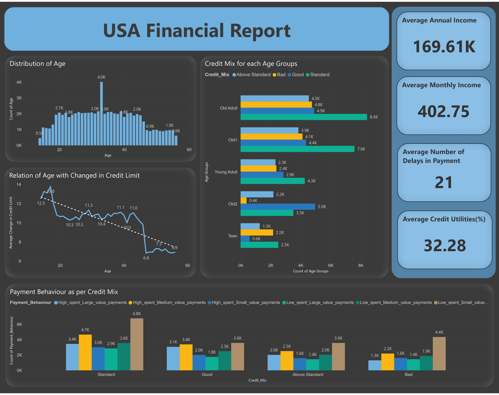
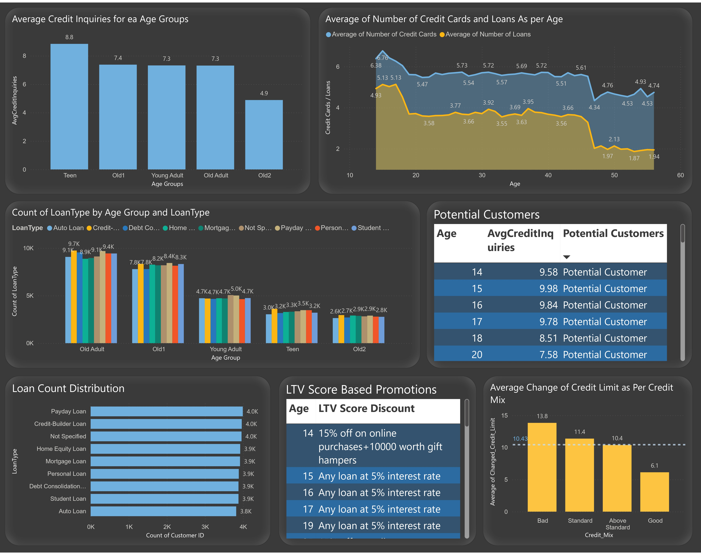
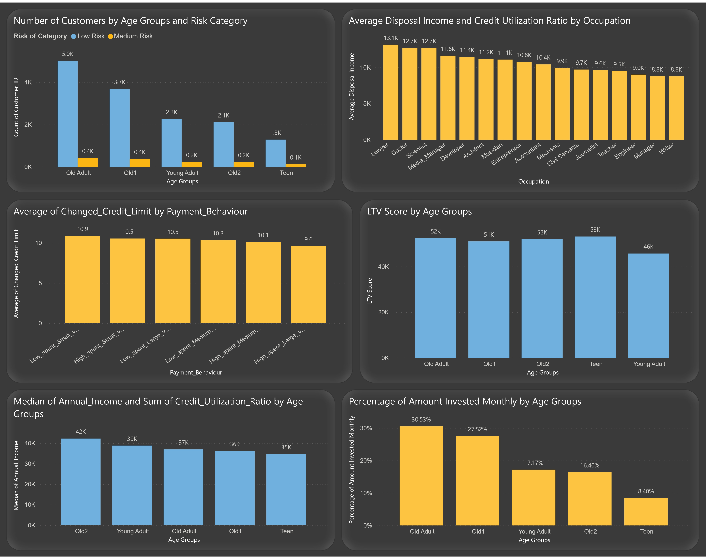

# Financial Analysis Report – Power BI

## [Go to Dashboard](https://app.powerbi.com/view?r=eyJrIjoiODI2NzdlNzktOGQwMy00YzM3LWEzZjctMDBkYWVjZTQ4MWM2IiwidCI6IjFkOTM3YmRjLTU5MDgtNDY4YS1hYjFmLTQ0OTNlNjgwOWE3NSJ9)

## **Overview**
This report leverages **Power Automate, Google Cloud Platform (GCP), and Python** to automate data ingestion and analysis in **Power BI**. It integrates email-based data fetching and scheduled refreshes to streamline financial insights.

## **Workflow Details**
### **Automated Data Fetching**
- **Trigger:** The workflow activates when a new email arrives in a specified Outlook folder.
- **Processing Attachments:** Each attachment is saved to **Google Drive** using Power Automate.
- **API Integration:** Google Cloud Platform (GCP) facilitates communication between Power BI and stored files.
- **Data Transport System:** Python scripts automate data transfer and refresh the Power BI model.

## **Key Analyses Conducted**
### **1. Financial Metrics Overview**
- **Average Annual Income**
- **Average Monthly Balance**
- **Average Delays in Payment**
- **Average Credit Utilization**

### **2. Credit Limit & Age Relationship**
- Evaluates how **customer age** influences **credit limit adjustments**.
- Examines **payment behaviors** across different credit mix categories.

### **3. Customer Age Distribution**
- **Distribution plot** visualizes the demographic spread of customers.
- Age groups are categorized as:
  - **Teen:** 14-19
  - **Young Adult:** 19-25
  - **Old Adult:** 25-35
  - **Old1:** 35-45
  - **Old2:** Above 45

### **4. Credit Score by Age Group**
- Analyzes the number of customers across different age groups with varying **credit scores**.

### **5. Payment Behavior Analysis**
- Identifies **frequency patterns** within each **credit mix category** to enhance risk management.

### **6. Potential Customer Identification**
- Determines **age groups** likely to seek **loan products** based on **inquiry history** (average inquiry > 7.5).

### **7. Loan-to-Value (LTV) Score Analysis**
- Computes **LTV scores** for different age groups to align marketing offers:
  - **LTV > 80000:** “30% off online + home loan at 4% interest”
  - **LTV 60000-80000:** “15% off + ₹10,000 gift hamper”
  - **LTV 50000-60000:** “Any loan at 5% interest”
- Formula used:  
    ```
    LTV = (0.3 * Avg Annual Income) - (0.15 * Avg Days in Payment Delay) + (0.4 * Avg Credit Score) + (0.075 * Avg Amount Invested) + (0.075 * Avg Monthly Balance)
    ```

### **8. Loan & Credit Card Ownership Trends**
- Examines **loan and credit card distribution by age** to identify trends.
- Insights used for **marketing targeted credit products**.

### **9. Loan Type Distribution Visualization**
- Displays **count of dispersed loans** to track **popular loan categories**.
- Helps in **rolling out tailored loan offers**.

### **10. Lifetime Value (LTV) Segmentation Across Occupation**
- Displays **high-value customer occupations** by age group to **target profession-specific offers**.

### **11. Credit Risk Heatmap**
- Displays **high-risk demographics** prone to **loan defaults or payment delays**.
- 
### **12. Income vs Credit Utilization Ratio Trend**
- Displays Analyze the correlation between **annual income and credit utilization ratio** across different age groups.  


## **Conclusion**
This report automates financial data analysis and enhances **decision-making** through **data-driven insights**. The integration of **Power Automate, APIs, Python, and Power BI** ensures seamless data flow, providing a **robust framework** for financial evaluations.
---
---

---

---

---
